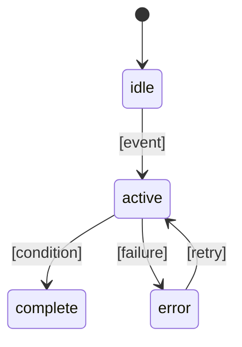

# 機能設計書

## 対象範囲と要件対応

| PRD要件 | 設計箇所 | テスト観点 |
| --- | --- | --- |
| [要件] | [節] | [観点] |

## 利用者フロー

### [フロー名]

1. [開始条件]
2. [操作とシステム応答]
3. [完了または失敗条件]

## 画面・コンポーネント

### [Screen / Component]

- 責務: [内容]
- 入力: [props / event]
- 出力: [表示 / callback]
- 依存先: [Hook / Service]
- 禁止事項: [内容]

## データ契約

```javascript
/**
 * @typedef {Object} [Entity]
 * @property {string} id
 * @property {[type]} [field]
 */
```

## 状態遷移



- 無効入力: [条件]
- 競合・重複防止: [方法]

## サービス・外部インターフェース

| 対象 | 責務 | 入力 | 出力 | 失敗時 |
| --- | --- | --- | --- | --- |
| [Service] | [責務] | [入力] | [出力] | [振る舞い] |

## エラーハンドリング

| 条件 | 表示 | 復旧方法 | 記録 |
| --- | --- | --- | --- |
| [条件] | [表示] | [方法] | [方法] |

## テスト戦略

- unit test: [対象]
- component test: [対象]
- 起動・実機確認: [対象]
- 利用可能な品質script: [package.json確認結果]

## 未決事項

- [事項]
